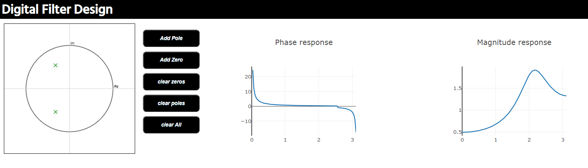
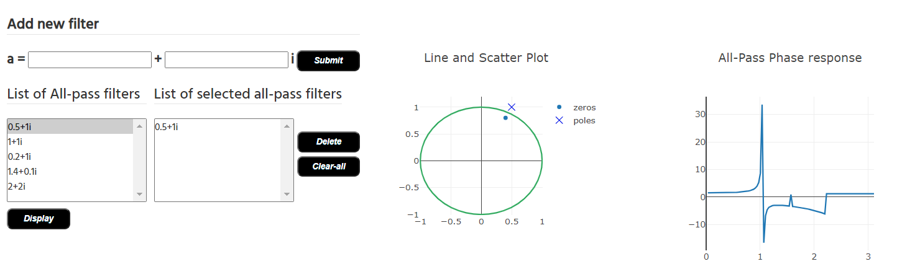
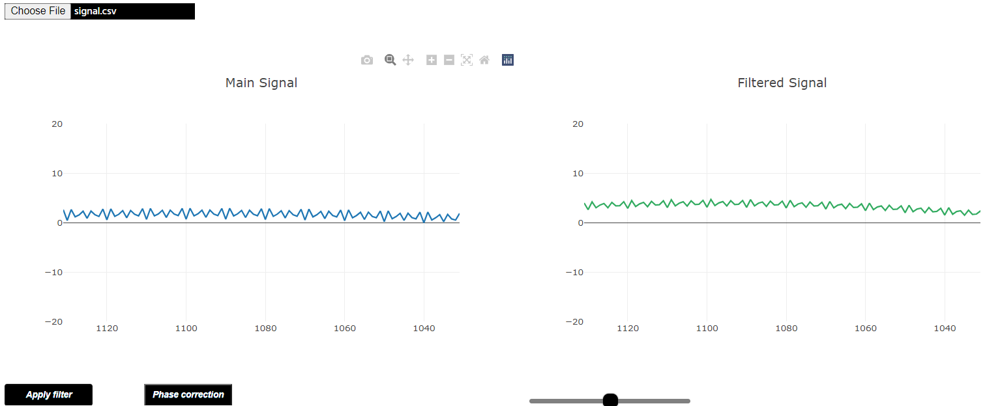

# Real-Time-Digital-Filter

## The website contains the following features:

### A z-plane with the unit circle, where the user can place different zeros and poles.
#### The user can also make the following modifications:
➢ Modify the placed zeros/poles by dragging them
 
➢ Click on a zero or pole and delete it using double click on it.
 
➢ Clear all zeros or clear all poles or clear all using clear poles button or clear zeros button.

### A graphical plot that shows the corresponding frequency response for the placed elements
Graphical plots for the magnitude response and the phase response are automatically generated for the added zeros and poles on the unit circle.

### All-pass library containing some popular custom-built all-pass:
➢Another feature in the library that the user can build his all-pass and add it to the library (i.e: adding it to the provided input “a”).
 
➢The picked all-pass or the one built by the user is visualized on unit circle specified to show the all-pass filter zeros & poles.
 
➢The website calculates the phase and the magnitude responses of the added all-pass on the unit circle
 
➢A graphical plots are atomatically generated for the phase and magnitude responses of the all-pass

### The user can Apply the filter on any signal to filtered in real-time (point by point)
➢A graph show the time progress of the original signal and another graph to show the time progress of the filtered signal 
(i.e. upon applying the difference equation on the points of the original signal one by one).
 
➢The user should be able to control the speed of the filtering process.
 
➢Correct for the phase by adding some All-Pass filters.

